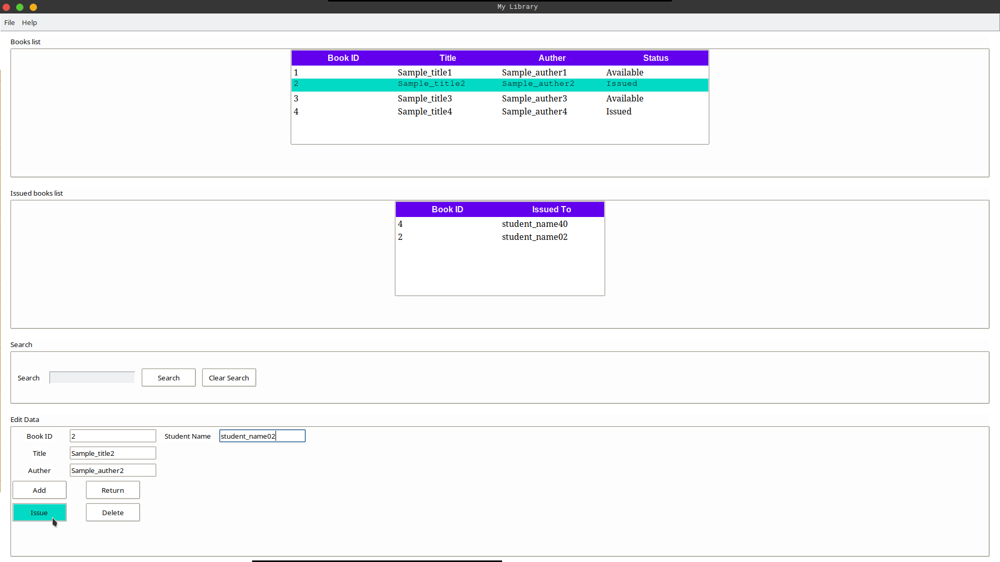
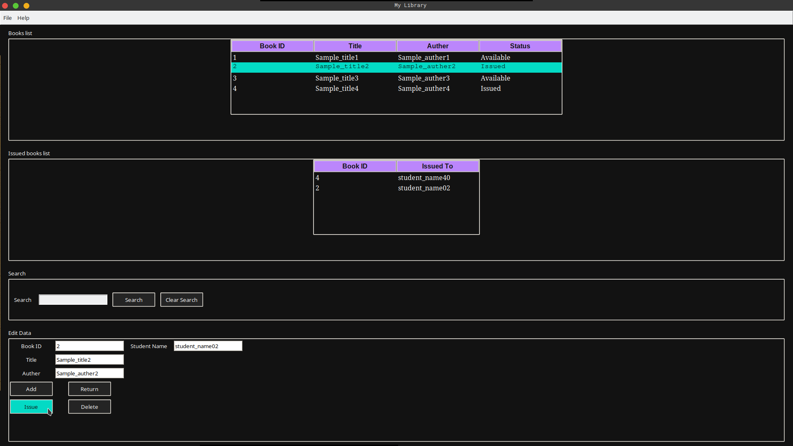

# Library-management-project-python
A library management system keeps track of the books present in the library. It is an important piece of software which is a must at schools and colleges. We will build a library management system using Tkinter to make it interactive.

## Using Pandas 

```bash
sudo apt install python3 python3-pip python3-tk 
pip install pandas 
pip3 install pandas || sudo pip3 install pandas 
```

### Gui Mode 

```bash
sudo apt install git
git clone https://github.com/Surajkumarsaw1/library-management-project-python.git
cd library-management-project-python
python3 guiPandasLib.py || sudo python3 guiPandasLib.py
```

### Cli Mode

```bash
sudo apt install git
git clone https://github.com/Surajkumarsaw1/library-management-project-python.git
cd library-management-project-python
python3 cliPandasLib.py || sudo python3 cliPandasLib.py
```

## Sample images


